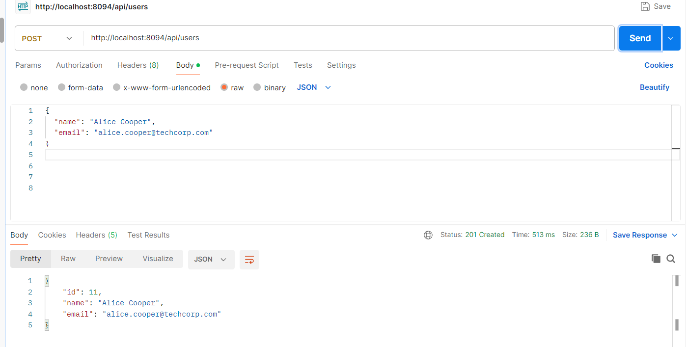
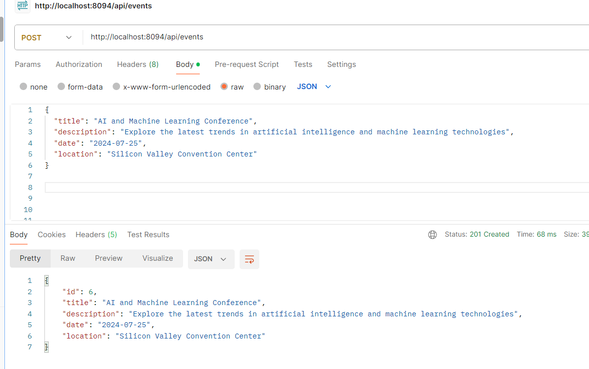
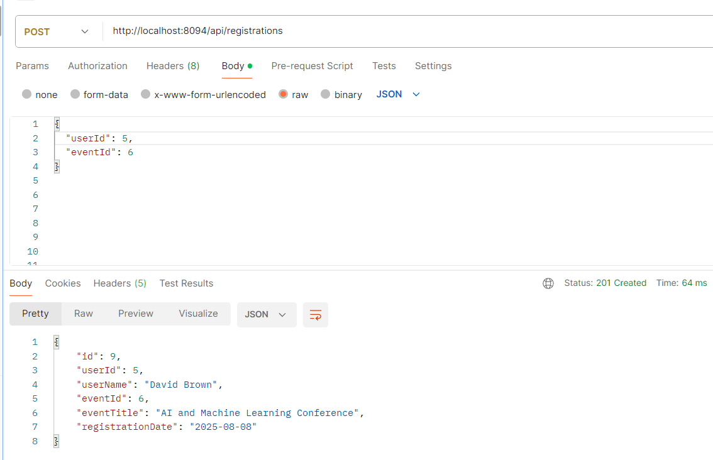
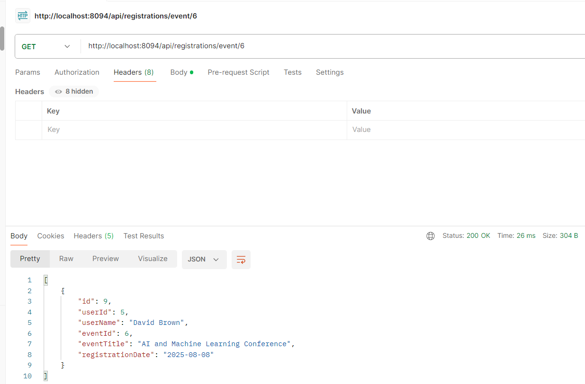

# API Response Screenshots

This document contains screenshots of the key API endpoints for the Event Management System.

## Required API Screenshots

Please attach screenshots for the following 4 key API endpoints:

### 1. Create User - POST /api/users

**Request:**
```json
{
  "name": "Alice Cooper",
  "email": "alice.cooper@techcorp.com"
}
```



```


### 2. Create Event - POST /api/events

**Request:**
```json
{
  "title": "AI and Machine Learning Conference",
  "description": "Explore the latest trends in artificial intelligence",
  "date": "2024-07-25",
  "location": "Silicon Valley Convention Center"
}
```



---

### 3. Register User to Event - POST /api/registrations

**Request:**
```json
{
  "userId": 1,
  "eventId": 1
}
```



---

### 4. Get All Registrations for Specific Event - GET /api/registrations/event/1



---

## Instructions for Screenshots

1. **Tool**: Use Postman, Insomnia, or any REST client
2. **Content**: Ensure both request body and response are clearly visible
3. **Status Codes**: Include HTTP status codes in screenshots
4. **Format**: Show both request and response in the same screenshot if possible
5. **File Names**: Save screenshots with descriptive names:
   - `create_user_response.png`
   - `create_event_response.png`
   - `register_user_event_response.png`
   - `get_registrations_by_event_response.png`
6. **Location**: Save all screenshots in a `screenshots/` folder
7. **Quality**: Ensure screenshots are clear and readable

## Screenshot Folder Structure

```
eventmanagement/
├── screenshots/
│   ├── create_user_response.png
│   ├── create_event_response.png
│   ├── register_user_event_response.png
│   └── get_registrations_by_event_response.png
└── API_SCREENSHOTS.md
```

## How to Replace Placeholders

1. Take screenshots of actual API responses
2. Save them in the `screenshots/` folder with the specified names
3. The markdown will automatically display the images
4. Verify all images are displaying correctly

---

**Note**: This document serves as a template for API testing documentation. Replace the placeholder images with actual screenshots from your API testing.